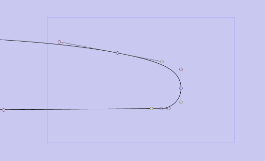

# BoardCAD user guide

# Introduction
BoardCAD is an open source CAD/CAM-system for
surfboards. It is aimed at making the design process easy and intuitive,
allowing the designer to be creative and play with
different designs. The result can be
visualized in 3D for quick feedback.
BoardCAD allows the shaper to print full
scale templates or have the board CNC-machined. A board can only be
validated in the water, but knowing
exactly what has been changed between different boards
allows the shaper to learn more from each of them.
BoardCAD doesn't make you a good
shaper, but used in the right way it can help the inexperienced
progress faster and the seasoned to become more productive.
Start with the quick tutorial to get a
feeling for the overall workflow and the functionality available, then go more in detail.
For information on how to download and install BoardCAD see [downloading and installing](/download-install.md).
For more general information about the project and contributing see [contribute](/contribute.md).

# EDITING
The outline, rocker and cross sections are defined using composite bezier curves. 
The curves consist of bezier curve segments which are defined by the blue end points
which the composite curve passes through and the yellow and red tangent control points which define 
the direction and 'velocity' of the curve at the endpoints and thus the shape of the segment. The endpoints
can be set to continous using the control point info, this ensures that the tangents of the previous 
segment and the next have the same direction making the curve smooth across the control point.

<figure>
  
  <figcaption align="center"><small>Control points</small></figcaption>
</figure>

There are three different ways to edit the curves: mouse, keyboard and through the control point info
user interface.

### Editing using the mouse
The curves can easily be edited by clicking on a control point and dragging it using the mouse.
Multiple control points can be selected by either dragging a box around them or holding down CRTL
while selecting multiple blue control points. Moving multiple control points can be useful f.ex. to 
maintain the same outline curve when adjusting the width of a board, maintaining the rail shape when 
adding concave or vee or maintaining nose and tail thickness when adjusting rocker. 

<figure>
  
  <figcaption align="center"><small>Multiselect control points</small></figcaption>
</figure>

Use the quad view to keep an overview of the entire board while editing, or select the individual profile, outline and cross sections 
tabs for more detailed view with less visual noise. While editing the coordinates of the mouse is displayed in the
top left corner of the view and the control point positions are updated in control point info.
While editing you can zoom using the zoom mode in the tool bar and dragging a box around the area you want to zoom on,
or you can use the scroll wheel on the mouse to zoom. To pan the view, use the pan mode in toolbar or click and hold the
scroll wheel and drag to pan. Click fit in the toolbar to fit the curves to the view after panning and zooming or use
spot check from the right click menu to quickly view the entire curves without loosing you zoom and pan and continue
working on the part of the board.
Additonal control points can be added using the right click menu in the view or the toolbar. Click on the curve to add the 
control point. Note that the curve will remain the same after adding a control point. Control points can be removed in the
same manner. Note that the curve is not guaranteed to remain the same after removing a control point. It's advicable to
use no more control points than neccasary to define the curves your after as curve segments are smoother than the composite
curves.
When editing cross sections you can select different cross sections by clicking on the position of the cross section on the outline.
Cross sections can be added, moved and removed from the right click menu. You can also copy and paste cross sections. If you intend
to have the board CNC'd using other software than boardCAD you should take particular care of not moving control point too extreme
between cross sections and keeping the same number of control points on each cross section.
Undo/redo can be done on every change you make to the curves. The number of operations you can undo is only
limited by available memory.

### Editing using the keyboard
There are numerous ways to edit the control points using the keyboard.
You can move the selected control point with the
arrow keys and A(left), S(right), D(up) and F(down). You can press once to
nudge the control point or hold the key down for larger movements.
To make a tangent longer press E
(extend), make it shorter by pressing R(retract). To rotate the
control point clockwise press W, to rotate it counterclockwise press Q.
By holding down the ALT key you can make fine adjustments as every editing
operation 1/10th of normal movement. Holding down ALT can also be combined 
with mouse editing for fine precision when dragging the points with the mouse.
The H key hides/shows the control points to view the curve without the noise of
the control points.
Press the < key to cycle through the tangents and endpoint
point (yellow, blue and red) at a location. 
Press the C key to cycle through the control points of a curve.
Control points can be deleted using the delete key.
Press +/- to cycle through cross sections.
Press B to toggle deck/bottom/both in the profile view
Use CTRL Z and Y to undo and redo editing.
Use CTRL S to save the board.

| Hotkeys | Function |
| ----------------------------------------- | ------------------------------------------ |
| arrow keys, A S D F | Move control point |
| E R | Extend and Retract tangent |
| Q W | Rotate tangent clockwise / counterclockwise |
| ALT | Fine adjustment |
| H | Hide / show control points |
| < | Cycle yellow / blue / red control points|
| C | Cycle control points of composite curve |
| + - | Cycle cross sections |
| B | Cycle deck / bottom /both |
| CTRL Z CTRL Y | Undo / Redo |
| CTRL S | Save board |

### Editing using control point info
Exact coordinates can be input the exact coordinate in
the respective text boxes (in the lower, right corner) and
click the set button.

### Input values
Inputs that take measurements can take the various formats
regardless of the selected unit f.ex imperial (ex. 6'10" or 3 1/4"), meters (ex.
0.5m), centimeters (ex. 50.5cm), or millimeters (ex. 2200mm).
If no unit is specified, the current unit will be used. For imperial 
the input value will be inches.

### Other useful features
* There is a sliding info bar for measurements at any given
point along the length of the board. In it, you can also show
over curve measurements which makes it possible to get
accurate measurements at any given point over the bottom
curve. Very useful to get measurements as exactly as
possible as it's hard to measure on the actual blank unless
you measure over the bottom curve. On the other hand, if
you look at these measurement with regards to the x
position the difference is not that big.
* You can view the curvature of the board to ensure that the
curve is smooth. In particular around a control point the
curvature graph may be discontinous. This may be visible in
a cut board or a template. The curvature graph can also be
used to analyze the curves beyond what is otherwise
possible visually. Note that the sliding info for bottom shows
the radius of the curvature at any point which is also useful
for analyzing the curvature of the rocker. Curvature can be
compared between boards by loading a ghost board, when G
is pressed the curvature of both the current board and the
ghost board are shown (if 'show curvature' is selected).
* If you have zoomed in close and want to see how your
changes affect the greater picture, you can click the spot
check button or space bar to view the entire board, when
you let go it returns to the previous zoom.

## SETTING
### Preferences
BoardCAD is intended to be used by anyone who is
interested in designing surfboards. Different
users have different needs and preferences. BoardCAD is
configurable and you can control
the visual apperance of the board models and what
design aids you'd like to be present on the screen. BoardCAD also support different languages.

### Design aids
Under the View-menu you'll find a list of different design
aids that can be switched on and off. While all are useful,
having all visible at the same time clutter the
workspace creating visual noise and make it difficult to edit the board. Most
of the aids are easy to understand:
- Shows a grid in the background. Depending on
whether the unit is set to metrics or imperial, the distance
between each grid-line is set to 1 cm or 1 inch respectively.
- Shows ghost board in the
background. See ghost board.
- Shows the curves of the current board before they were edited.
- Show the control points that allows the
curve to be edited. By hiding these no editing can be done
to the curve, but viewing the curve without any visual noise
can be useful.

- Show all cross section simultaneously in the cross section view.
- Show Guide points. See guidepoints.
- The curvature is a measure of how far from
flat a curve is. For a flat line the curvature is equal to zero,
and for other curves the curvature is equal to the inverse of
its radius at every point. This means that if the curvature of
the rocker is equal to zero, the rocker is totally flat at that
point, and if it goes below zero it means that the board has
negative rocker.
- Shows much volume each part of
the board has.
- This shows the volume center
- The sliding info gives information about the
width and thickness of the board at the point where the
mouse is placed.
- Shows the cross section at the
point where the mouse is placed.
- Shows fin position
- Shows a background image if such
image is loaded. More info on backgroud images can be
found in chapter 4.
- Using anti-aliasing smoothens the jagged
lines that occurs due to the low resolution of computer
screens.
- Shows a zero-line under the board
- Shows the distance over
the bottom tail, from the tail and the nose, to the current
mouse position.
- Shows where the cross sections
are placed.
- Shows the flow of the rail at 30, 45, 60, and
90 degrees
- Shows the tucked under
- Shows rocker and width of board at tail,
nose, center, one-foot-off and two-foot-off.
3.2 Setting visual appearance
By choosing Misc, Settings, in the menu you get a dialog
window where it is possible to configurate the visual
appearance of the board model and all the design aids
described above. The dialog window has three tabs.
- In the size and thickness you can control
the size of the control points and the line thickness of the
board model.
- A number of different configurations that didn't fit
under the other tabs. Look and feel lets you set the
appearance of the GUI, in order to give BoardCAD either a
platform independent look and feel like Metal or a native
look and feel that make BoardCAD look more like a native
application and less java-like. Print guide points, and Print
fins, configures whether those will be visible when printing
board information sheets or templates. The fraction
accuracy configures to what fraction of an inch that
measurements will be shown, when imperial units are used.
Default value is 16, i.e. 1/16 of an inch. If Use Rocker Stick
Adjustment is turned on, the rocker will be adjusted so the
center tangent is level. This is similar to the industry
standard way of measuring rocker with a rocker stick. Offset
interpolated cross sections by rocker means that the cross
sections will be drawn in their full 3D-position rather than
flat. This is especially useful when comparing the rail of the
3D-model with the rail of drawn in the 2D-view.
- Let you set the color of the board model and the
different design aids.

### Choosing Bezier interpolation
It is possible to configure how the cross sections are
interpolated in the Bezier model. This affects the form of
the sliding cross section, if you have chosen to view this and
how the 3D model is generated.
The two methods should give similar results, but 
cross section interpolation gives best result if all cross
sections have the same number of control points, S-blend 
interpolation is more reliable when different number of control 
points are used.

### Setting language
It is possible to change the language of the menus in
BoardCAD. This is done under the menu Misc, Language.
Currently six languages are supported: English, French,
Portuguese, Spanish, Norwegian, and Dutch. You will need
to restart BoardCAD for the changes to appear.

When designing a new board it is common to get some
inspiration from other designs, by copying for example the
outline, or just comparing the current design with other
designs. Depending on what you have at hand, this can be
done in different ways. If you already have the model of the
other board you can load the board and show it in the
background as a Ghost board. If you have the physical
board you can take take measurements and add those
as guide points. If you have a picture of the board you can use that
as a template by displaying the picture in the background.

### Ghost board
A ghost board can be loaded in the background to compare
designs. The ghost board can be moved by holding down G
(brings it into focus) and using the arrow keys.
The ghost board can also be scaled to the same size as the
current board using the command in the board menu. Ghost boards
can be rotated using the Q an W hotkeys.

### Guide points
You can add guidepoints by clicking the Add guide point
button and directly insert the point in the 'board area' by
clicking. You can also open the Guide points table either via the
Board menu or via Right click of the mouse. Once the table
is open you can directly edit any existing guide points by
double clicking. By right clicking the mouse you can choose
to add new guide points via (x,y) coordinates or you can
choose to remove any highlighted guidepoints.

### Background image
A background image can be loaded in every view. This is
positioned by holding down T and clicking on the tail of the image, 
and holding down N and clicking on the nose.

## PRINTING
Board templates can be printed in full scale. In addition
a spec sheet page can be printed or saved to an image file.
Printing to pdf is currently not supported, but a virtual pdf
printer can be used to generate pdf files.

### Printing spec sheets
You can print a spec sheet by clicking the
"Print spec sheet" icon in the toolbar, or from the submenu Print in
the File menu.

### Printing templates
When printing templates, the margins should be adjusted to
the absolute minimum your printer can handle to minimize
the amount of paper used. The difference between a wide
and narrow margin can be the difference between one
and two strips of paper being used. If you loose data in the
print, adjust the margins up.
Note that printers may distort the image when print due to
the paper feeding mechanism being inaccurate. It is
recommended that you check the accuracy against the grid 
where each square should be an inch.

## EXPORTING MODELS
One of the strength of BoardCAD is the possibility to
exchange the board models with third party commercial
CAD/CAM-systems. From version 2.0 we even base our
native file format on STEP. This means that our board
models can now be read directly by most CAD-systems
without the need for exporting the board model. However,
while STEP is an international standard it is still not
supported by all systems. BoardCAD therefore support
several different file format. The board can be exported in
3D in the formats step, dxf and stl to be cut by most
standard CNC machines. To export in these formats you
need to convert the board to 3D first. The board profile and
template can also be exported in two different dxf formats
to be used for cutting foam block with a hotwire cutter or
cutting templates. Here we give a short introduction to the
different formats and what is included in each of them in
order to understand their strenghs and limitations.

### STEP
STEP (ISO 10303 - STandard for the Exchange of Product
models) is an international standard for exchanging CAD
data. This is a very large standard including not only the
geometry model, but also large amounts of meta-data. Due
to the large size, the STEP standard is divided into several
APs (Application Protocols). The geometry data is defined in
AP42, but most CAD-system implements AP203
(Configuration Controlled Design) and AP214 (Automotive
Design).
BoardCAD exports models based on AP203. The exported
model include Bezier curves for outline, rocker, and cross
sections, as well as well nurbs surfaces for the 3D-model.
Most CAD-systems will read the files, but in many cases
only the 3D-model will be shown.

### STL
STL is a file format native to the stereolithography CAD
software created by 3D Systems. This file format is
supported by many other software packages; it is widely
used for rapid prototyping and computer-aided
manufacturing. An STL file describes a raw unstructured
triangulated surface. For BoardCAD this means that the
orginal Bezier curves and nurbs surfaces cannot be
described. Instead a triangulated model of the board is
exported, i.e. the nurbs surfaces are converted into lots of
small triangles. This makes the model very hard to edit
when imported in another CAD-system. However, as long as
the model will not be edited further the triangulated models
work fine.

### DXF
AutoCAD DXF (Drawing Interchange Format, or Drawing
Exchange Format) is a CAD data file format developed by
Autodesk for enabling data interoperability between
AutoCAD and other programs.
With DXF, the 3D-model is limited to triangulated surfaces,
just like in an STL-file, an therefore not suited for further
editing.
Apart from the 3D-model, DXF-files can also export 2D
Bezier curves. This is useful for exporting the outline, rocker,
and cross sections for creating templates.

## GENERATING AND EXPORTING G-CODE
With the release of version 2.0, BoardCAD does not only
include full support for CAD (Computer Aided Design), but
also for CAM (Computer Aided Manufacturing). BoardCAD
can be configured to work with most types of 3-axis and 4-
axis CNC machines (see Appendix A for instructions on how
to configure your machine). This chapter gives step by step
instructions on how to generate the G-code that controls the
CNC-machine. All operations are done on the 3D-model and
does not work with Bezier-models. If your boards or blanks
are saved as .brd-files they should first be converted to
NURBS-models and saved with .stp or .cad extension.
G-code is generated separately for the deck and for the
bottom. You can start either by cutting the deck or by
cutting the bottom. Here we start by cutting the deck.
10.1 Placing board model inside the
blank
First we open our blank model. The blank model is just like
any board model and is open through the File menu, Open
board.
It is important to verify that the X-position of the blank
model corresponds to the X-position of real blank in the
machine. The routine for how to do this may differ slightly
between different machines. However, all machines have an
X-position that corresponds to X=0 in BoardCAD and that
should be clearly marked (in Appendix A we show exactly
how to setup this point). Now, if the blank is placed 100 mm
in front of this point, but the blank model is placed at X=0,
we need to translate the blank model to X=100 mm. This is
done with the "Translate X" in the 3D-menu, under the
submenu Transform.
Personally I've premarked the position of each blank size in
the machine, and saved all my blank models in the correct
position, in order to minimize the work.
Now let's assume that the blank model is already in the
correct X-position. The blank is like any board model in
BoardCAD, so the first thing we have to do is to tell
BoardCAD that this model should be used as our blank. This
is done by selecting "Set as blank" in the 3D-menu. When
doing this the model will disappear from the workspace. To
see the blank you have to right click the mouse in
workspace and choose "view blank" in the popup menu.
Next we load the board that we want to cut. The board
model must be placed inside the blank. This can easiest be
done in the profile view. Use the commands "flip board",
"translate x", "translate y", and "rotate" in the 3D menu to
move the board model. One useful trick when rotating a
board is to mark a control point in the board model that the
board will rotate around. If no control point is marked the
board will rotate around origo. Once you have positioned the
board inside the blank it is good practise to save the model
so you don't have to do this again if you want to cut the
same board using the same blank in the future.

### Generating deck cuts
While we have already made sure that the horizontal
position of the blank model corresponds to the horizontal
position of the real blank in the machine, the same has to
be done with the vertical position. This is done with the
funcion "Place blank" in the 3D menu. This function will read
the position of the blank supports from the machine
configuration and move the blank, and the board inside the
blank, until the blank rests on the supports. Now we can
generate the cutting paths for the deck. This is done by
choosing File, G-code, Nurbs to Gcode deck. Enter the file
name for the cutting paths. While the file itself contains
plain text, different machine controllers look for different file
extensions. For example, machine controllers based on
Linux CNC want the file name to end with the extension
.ngc, so here we name the file deck.ngc.
We can visualize the cutting paths by marking "View deck
cuts" in the popup menu.

### Generating bottom cuts
Generating tool paths for the other side of the board is easy.
All we need to do is to choose "Flip board" in the 3D menu,
followed by "Place board". This turns the board and make
sure it is correctly placed on the machine supports. We are
now ready to generate g-code by selecting File, G-code,
Nurbs to Gcode bottom. We name the file bottom.ngc. Again
we can visualize the cutting paths by marking "View bottom
cuts" in the popup menu.
